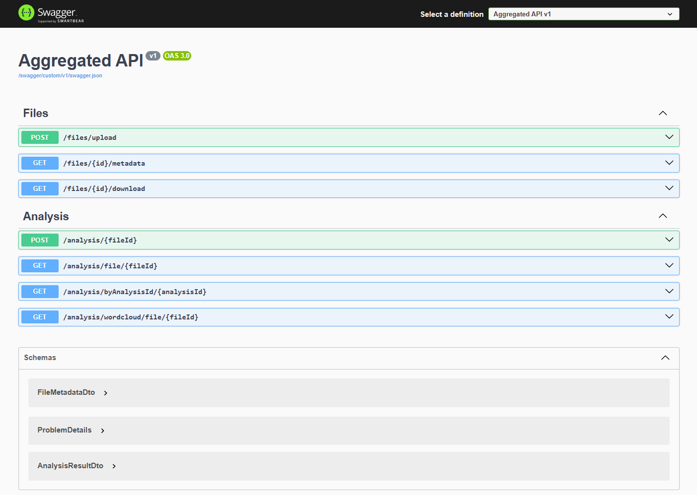
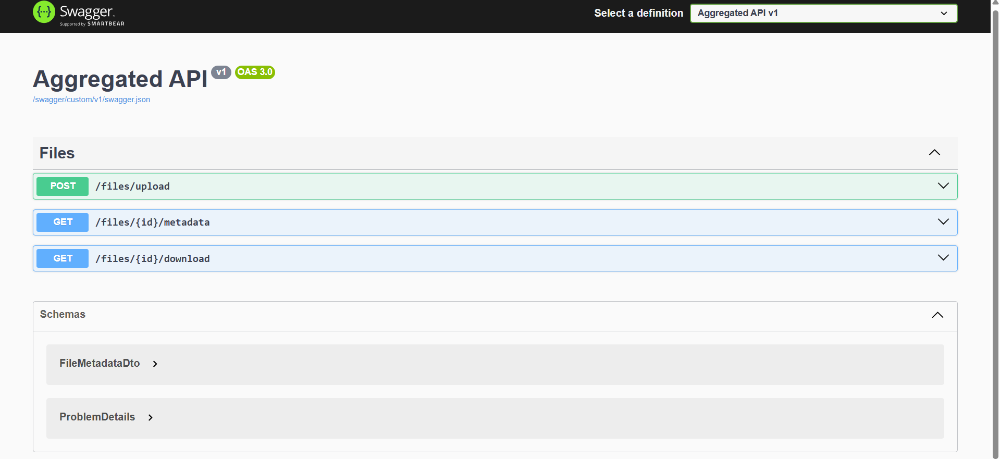

# КР-2. Микросервисная система антиплагиат

## Сервисы и БД

- **ApiGateway** — точка входа в систему для клиентов.
- **FileStoringService** — хранение и управление загруженными файлами.
- **FileAnalysisService** — анализ содержимого файлов.
- **PostgreSQL** — отдельные экземпляры для сервиса хранения и анализа файлов.

## Архитектура

```text
Client
  │
  v
[ApiGateway :8888]
  ├──> [FileStoringService :8889]
  │        └──> [PostgreSQL (db_filestoring) :5433]
  │
  └──> [FileAnalysisService :8890]
           ├──> [PostgreSQL (db_fileanalysis) :5434]
           └──> [WordCloud API: https://quickchart.io/wordcloud]
```

## Запуск

Для запуска используется docker-compose:

```bash
docker-compose up --build
```

## API

Общение с программой происходит через ApiGateway. Можно использовать Swagger:

```text
http://localhost:8888/swagger/index.html
```


### Загрузка файла

```http
POST /files/upload
```
**Параметры запроса**
- `file` — текстовый файл для загрузки (.txt).

**Ответ**
```json
{
  "fileId": "abc123",
  "fileName": "document.txt",
  "uploadTime": "2025-05-29T14:12:00"
}
```

**Принцип работы**

Запрос переходит на FileStoringService, который сохраняет файл и записывает его метаданные в базу данных PostgreSQL.

### Получение метаданных
```http
GET /files/{id}/metadata
```

**Параметры запроса**
```json
{
  "id": "3fa85f64-5717-4562-b3fc-2c963f66afa6",
  "originalFileName": "string",
  "contentType": "string",
  "fileSize": 0,
  "uploadedAt": "2025-05-29T20:46:52.231Z"
}
```

**Ответ**
```json
{
  "id": "a071666d-76dd-4b45-99c2-cdc03d0fc84a",
  "originalFileName": "tyan.txt",
  "contentType": "text/plain",
  "fileSize": 835,
  "uploadedAt": "2025-05-29T20:28:45.16561Z"
}
```

**Принцип работы**

Запрос переходит на FileStoringService, который извлекает метаданные файла из базы данных PostgreSQL и возвращает их в ответе.

### Скачивание файла
```http
GET /files/{id}/download
```

**Параметры запроса**
- `id` — идентификатор файла.

**Ответ**
- Файл в формате `.txt`.

**Принцип работы**

Запрос переходит на FileStoringService, который извлекает путь к файлу из базы данных PostgreSQL и возвращает файл в ответе.

### Анализ файла
```http
POST /analysis/{fileId}
```

**Параметры запроса**
- `fileId` — идентификатор файла для анализа.

**Ответ**
```json
{
  "analysisId": "653f7ebf-addb-4955-9d03-7fbd1452cd34",
  "fileId": "b837802e-8716-4d13-9cfd-0a19cf84d9da",
  "fileHash": "D6E252EF9F84FEB0FC699529ED22616B8C4592A95D2DC4A7C5EEDDC8074DF7C2",
  "paragraphCount": 1,
  "wordCount": 16,
  "characterCount": 236,
  "plagiatData": "{\"IsPlagiat\":false,\"OriginalFileHash\":null,\"OriginalFileId\":null}",
  "wordCloudImagePath": "c8d9901f-3917-485e-8e82-a911f9bf3273.png",
  "analysisStatus": "Completed",
  "completedAt": "2025-05-29T20:51:30.6054008Z",
  "errorMessage": null
}
```

**Принцип работы**

Запрос переходит на FileAnalysisService, который получает файл из FileStoringService. FileAnalysisService выполняет анализ и проверку на
плагиат (сравнивает с кэшами файлов, которые ранее были проанализированы. Кэши хранятся в PostgreSQL для FileAnalysisService).
Сервис также получает облако слов и сохраняет путь к изображению. Результаты сохраняются в базе данных PostgreSQL и возвращаются в ответе.

### Получение результатов проведенного ранее анализа
```http
GET /analysis/file/{fileId}
```
или
```http
GET /analysis/byAnalysisId/{analysisId}
```

**Параметры запроса**
- `fileId` — идентификатор файла или `analysisId` — идентификатор анализа.

**Ответ**
```json
{
  "analysisId": "653f7ebf-addb-4955-9d03-7fbd1452cd34",
  "fileId": "b837802e-8716-4d13-9cfd-0a19cf84d9da",
  "fileHash": "D6E252EF9F84FEB0FC699529ED22616B8C4592A95D2DC4A7C5EEDDC8074DF7C2",
  "paragraphCount": 1,
  "wordCount": 16,
  "characterCount": 236,
  "plagiatData": "{\"IsPlagiat\":false,\"OriginalFileHash\":null,\"OriginalFileId\":null}",
  "wordCloudImagePath": "c8d9901f-3917-485e-8e82-a911f9bf3273.png",
  "analysisStatus": "Completed",
  "completedAt": "2025-05-29T20:51:30.6054008Z",
  "errorMessage": null
}
```

**Принцип работы**

Запрос переходит на FileAnalysisService, который извлекает результаты анализа из базы данных PostgreSQL и возвращает их в ответе.

### Получение изображения облака слов
```http
GET /analysis/wordcloud/file/{fileId}
```

**Параметры запроса**
- `fileId` — идентификатор файла.

**Ответ**
- Изображение облака слов в формате PNG. Например: 

**Принцип работы**

Запрос переходит на FileAnalysisService, который извлекает путь к изображению облака слов из базы данных PostgreSQL и возвращает его в ответе.

## Стабильность работы

Если какой-либо из сервисов не отвечает, ApiGateway все еще может общаться с другим сервисом. Например, я выключил AnalysisService, и ApiGateway продолжает работать с FileStoringService:
